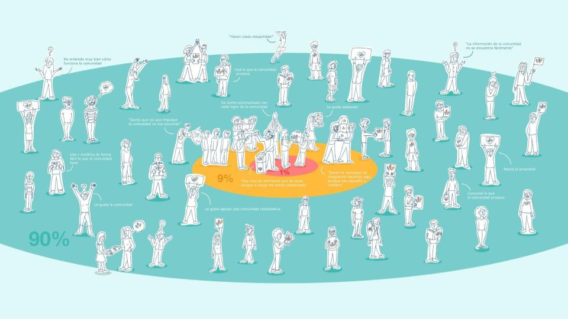

## Historia
	- ### Orígenes del Software Libre
		- Primeros desarrllos: colaborativos, en universidades ...
	- ### Bienes Comunes
		- {:height 558, :width 778}
		-
	- ### Comunidades del procomún
		- 
	- ### Cultura Libre
		- #### Licencias:
			- Dominio público
			- [Creative Commons](https://creativecommons.org/)
			- Copyleft
-
- ## Open ...
	- ### [[Open Access]]
	- ### [[Open Science]]
		- [Open Science Framework](https://osf.io/)
	- ### [[Open Data]]
		- [A Practical Framework for Applying Ostrom’s Principles to Data Commons Governance - Mozilla Foundation](https://foundation.mozilla.org/en/blog/a-practical-framework-for-applying-ostroms-principles-to-data-commons-governance/)
	- ### [[Open Peer Review]]
	- ### [[Open Education]]
		- [Open Educational Resources Commons](https://oercommons.org/)
	- ### [[Open Artificial Inteligence]]?
		- [Open Source AI Definifinition - 1.0](https://opensource.org/ai/open-source-ai-definition)
		- [Downloading closed knowledge: Aaron Swartz vs Meta](https://www.reddit.com/r/lostgeneration/comments/1ilg4ta/pour_one_out_for_a_real_one_fuck_zuckernazi/)
			- Ver también el documental sobre Aaron Swartz:
				- {{video https://www.youtube.com/watch?v=M85UvH0TRPc}}
			-
- ## Debate y Reflexiones Finales
	-